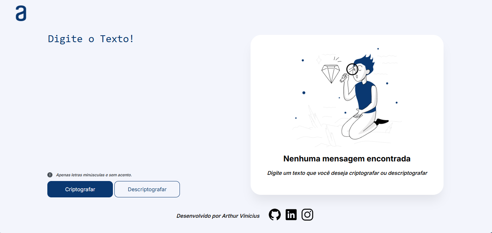

# DesafioONE

**OLÁ!!!** Sou o Arthur, e este é o meu projeto do **DesafioONE Turma7**! 🎉

Criei esta aplicação web para criptografar e descriptografar mensagens de texto, usando nada mais, nada menos que **HTML**, **CSS**, e **JavaScript**. Segui o design proposto pelo desafio, e posso dizer que foi uma experiência incrível! Este projeto está aberto para sugestões e melhorias! Se você tiver ideias ou encontrar algo que pode ser aprimorado, sinta-se à vontade para contribuir, e entrar em contato comigo!!



## O que o projeto faz

Esta aplicação permite que você:
- **Criptografe** uma mensagem de texto, transformando caracteres em um formato codificado.
- **Descriptografe** uma mensagem codificada, retornando ao texto original.
- **Copie** a mensagem resultante para a área de transferência com um clique.

## Como usar

1. **Digite** o texto no campo de texto.
2. **Clique** em "Criptografar" para transformar o texto.
3. **Clique** em "Descriptografar" para reverter o texto para o formato original.
4. **Clique** em "Copiar" para copiar o texto resultante para a área de transferência.

## Funcionalidades

- **Criptografar:** Transforma um texto simples em uma mensagem criptografada utilizando substituições de caracteres específicas.
- **Descriptografar:** Reverte o texto criptografado para sua forma original.
- **Copiar Texto:** Permite copiar o texto criptografado ou descriptografado para a área de transferência.

## Regras de Criptografia

As regras de substituição são as seguintes:

- **"e"** é convertido para **"enter"**
- **"o"** é convertido para **"ober"**
- **"i"** é convertido para **"imes"**
- **"a"** é convertido para **"ai"**
- **"u"** é convertido para **"ufat"**

### Requisitos:
> - Deve funcionar apenas com letras minúsculas
> - Não devem ser utilizados letras com acentos nem caracteres especiais
> - Deve ser possível converter uma palavra para a versão criptografada e também retornar uma palavra criptografada para a versão original.

> Por exemplo:
```Js
    "gato" => "gaitober"
    "gaitober" => "gato"
```

> - A página deve ter campos para inserção do texto a ser criptografado ou descriptografado, e a pessoa usuária deve poder escolher entre as duas opções
> - O resultado deve ser exibido na tela.

## Tecnologias Utilizadas

- **HTML:** Para a estrutura da página.
- **CSS:** Para o estilo e layout da página.
- **JavaScript:** Para a lógica de criptografia, descriptografia, e funcionalidades interativas.

## Como executar o projeto

1. Clone o repositório para sua máquina local:
    ```bash
    git clone https://github.com/seu-usuario/seu-repositorio.git
    ```
2. Navegue até o diretório do projeto:
    ```bash
    cd seu-repositorio
    ```
3. Abra o arquivo `index.html` em seu navegador para visualizar a aplicação.

## Estrutura do Projeto

- `index.html`: Contém a estrutura HTML do projeto.
- `style.css`: Contém os estilos CSS.
- `Javascript.js`: Contém a lógica JavaScript para as funcionalidades do projeto.
- `Imgs/`: Diretório que armazena as imagens utilizadas no projeto.

## Autor

Desenvolvido por **Arthur Vinícius Albuquerque Dos Santos**.

- [GitHub](https://github.com/Albuquerque29)
- [LinkedIn](https://www.linkedin.com/in/albuquerque29)
- [Instagram](https://www.instagram.com/albuquerque29_/)

## Licença

Este projeto é licenciado sob a Licença MIT - veja o arquivo [LICENSE](LICENSE) para detalhes.
